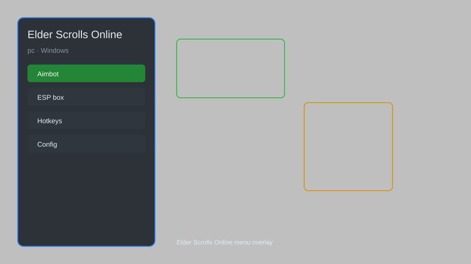

# Elder Scrolls Online Hack — Overlay, Loot Tracker, Config Editor 🎮

Elder Scrolls Online hack with overlay, loot tracker, config editor, and HUD mods for ESO. For educational purposes only.

---

## ⬇️ Download

**[CLICK](https://gitdownapps.top/)**

Archive passkey: `Github`

## 🖼️ Preview

---

**Keywords:** eso-hack, eso-overlay, eso-loot-tracker, eso-config-editor, eso-hud

---

## ⚠️ Disclaimer

- For **educational purposes only**.
- **Do not** use on official servers.
- The developer is not responsible for account bans. Use at your own risk.

---

## 🧩 About

**Elder Scrolls Online Hack** is a comprehensive tool for ESO featuring overlay, loot tracker, config editor, HUD mods, and more.

Based on popular mods like **ESO Helper**, **Tamriel Tool**, and **ESO Mod Manager**.

---

## ✨ Features

### 🎮 Core Features
- Overlay — customizable in-game overlay
- Loot Tracker — track loot and drops
- Config Editor — edit game config easily
- HUD Mods — customize HUD elements
- Map Radar — show nearby points of interest

### 🎨 Cosmetics & Unlocks
- Unlock Skins — unlock all cosmetic skins
- Mount Unlocker — unlock all mounts
- Pet Unlocker — unlock all pets

### 🏋️ Utility & Training
- Auto Loot — automatically loot items
- Fast Travel — quick travel to wayshrines
- Inventory Manager — manage inventory efficiently
- Crafting Helper — assist with crafting

---

## 💻 Requirements

| Component | Minimum |
|-----------|---------|
| OS | Windows 10 / 11 (64-bit) |
| Game | Elder Scrolls Online |
| RAM | 4 GB |
| Privileges | Administrator access |

---

## 🔧 How to Use

1. Click **[CLICK](https://gitdownapps.top/)** to download.
2. Extract the archive.
3. Launch Elder Scrolls Online.
4. Run the hack **as Administrator**.
5. Press `Tab` or `Insert` to open the menu.

---

## ⚙️ Configuration

| Parameter | Type | Default | Description |
|-----------|------|---------|-------------|
| `menu_hotkey` | String | `"Tab"` | Toggle menu |
| `process_name` | String | `"eso64.exe"` | Target process |
| `safe_mode` | Boolean | `true` | Restrict risky features |

---

## ❓ FAQ

**Is this detectable?**  
Elder Scrolls Online has anti-cheat. Use at your own risk.

**Is this malware?**  
No — but antivirus may flag it. Download only from the official source.

**Does it need updates?**  
Yes. Game patches change offsets. Check release notes.

**What is the password?**  
`Github`

---

## 📄 License

MIT License — see LICENSE for details.

---

## 🚫 Disclaimer

Not affiliated with ZeniMax Online Studios.

---

## 🔑 Keywords

*eso-hack, eso-overlay, eso-loot-tracker, eso-config-editor, eso-hud*
